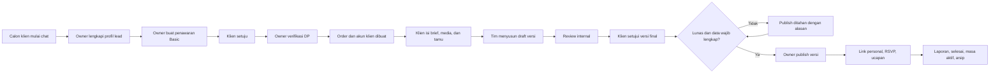

# Occasio — Audit Aplikasi dan Peta UX (G1)

Versi: audit awal 1.0 · 8 September 2026

Status: **Tahap 1 sedang berjalan**. Dokumen ini mencatat keadaan kode, bukan klaim bahwa fungsi sudah operasional. Pemeriksaan runtime, seluruh field, serta seluruh kondisi gagal masih dilanjutkan sebelum G1 dinyatakan lulus.

Acuan produk: [business-model-occasio.md](business-model-occasio.md). Acuan tahapan: [roadmap-production.md](roadmap-production.md).

## 1. Arti status audit

| Status | Arti |
| --- | --- |
| Belum ada | Kebutuhan bisnis belum memiliki layar atau alur |
| Demo lokal | Terlihat atau dapat diklik, tetapi bergantung pada seed, localStorage, nilai statis, atau simulasi |
| Terhubung | Sudah memakai sumber data persisten yang direncanakan dan hak aksesnya diterapkan |
| Teruji | Alur berhasil dan gagal sudah diuji lintas identitas/perangkat sesuai skenario bisnis |

Tidak ada modul yang diberi status **terhubung** atau **teruji** hanya karena halaman dapat dibuka atau build berhasil.

## 2. Inventaris permukaan dan route saat ini

| Permukaan | Route/alamat | Tujuan saat ini | Status | Keputusan G1 |
| --- | --- | --- | --- | --- |
| Website publik | `localhost:4174` | Informasi layanan dan pintu masuk calon klien | Demo lokal | Tetap menjadi website publik; paket yang belum dijual harus diberi status yang jujur |
| Login management | `/` → `/login` | Pintu masuk owner dan klien | Demo lokal | Pertahankan redirect langsung ke login; hilangkan bahasa marketing dari pengalaman management |
| Login | `/login` | Memilih/memasukkan akun demo | Demo lokal | Satu form login; role ditentukan oleh akun server, bukan pilihan bebas pengguna |
| Owner dashboard | `/owner/dashboard` | Ringkasan event, pipeline, task, billing, publish | Demo lokal campuran | Susun ulang menjadi inbox/lead, order, produksi, pembayaran, acara, dan laporan berbasis data nyata |
| Buat event | `/owner/events/new` | Wizard membuat klien dan event | Demo lokal | Event hanya dibuat dari order/DP terverifikasi; default harus draft dan belum published |
| Detail event owner | `/owner/events/[id]` | Edit event, tamu, ucapan, media, template | Demo lokal | Ubah menjadi workspace operasional berdasarkan order dan kewenangan |
| Client dashboard | `/client/dashboard` | Brief, konten, tamu, RSVP, ucapan, review | Demo lokal | Fokus pada pekerjaan klien; tampilkan order, progres, invoice, chat, approval versi, dan batas Basic |
| Chat | `/chat` | Percakapan owner–klien | Demo lokal | Thread harus dinamis dan privat; calon klien dapat chat sebelum mempunyai event/order |
| Intake lama | `/consultation` | Menyimpan form konsultasi lokal | Demo lokal; alur lama | Ganti menjadi brief terstruktur di dalam chat/CRM; migrasikan lead lama bila ada |
| Galeri management | `/gallery` | Katalog/template bergaya website publik | Demo lokal | Katalog publik berada di web publik; management hanya memilih template yang tersedia untuk order |
| Undangan | `/wedding/[slug]` | Render undangan berdasarkan slug | Demo lokal | Route publik hanya merender versi published; preview privat memakai mekanisme terpisah |
| Check-in | `/checkin/[slug]` | Pencarian dan check-in tamu | Demo lokal | Di luar rilis Basic; dikunci sampai Premium dan G8 dikerjakan |

## 3. Temuan tindakan dan status yang menyesatkan

| Temuan kode | Risiko bisnis | Prioritas |
| --- | --- | --- |
| Login mencari email lokal dan parameter password belum diverifikasi | Siapa pun yang mengetahui email demo dapat masuk; tidak ada identitas produksi | P0 |
| Chat memakai thread `evt-1`, nama Sheila, dan label `Online` statis | Pesan tidak terpisah per calon klien/event dan status kehadiran palsu | P0 |
| Membuat event menetapkan `isPublished: true` | Draft baru dapat dianggap sudah terbit tanpa approval dan pelunasan | P0 |
| Tombol owner mengubah status event secara langsung | Status order, pembayaran, konten, dan publikasi tercampur | P0 |
| Review owner menyimpan `approved` sebelum callback publish selesai | UI dapat menyatakan sukses ketika publish gagal | P0 |
| Undangan publik belum memaksa `isPublished` | Draft berpotensi terbuka dari slug | P0 |
| Link tamu memakai nama pada query dan view mengambil daftar tamu | Identitas lemah; tamu bernama sama berisiko tertukar dan data berlebih masuk ke sisi publik | P0 |
| Status “Sudah dikirim” disimpan setelah membuka WhatsApp | Membuka WhatsApp bukan bukti pesan benar-benar terkirim | P0 |
| Progress client selalu menganggap preview siap | Persentase kesiapan dapat terlalu tinggi | P1 |
| Statistik check-in dan beberapa pipeline/task/billing berasal dari data contoh | Dashboard dapat menampilkan angka operasional palsu | P0 |
| Media memakai object URL browser | File hilang setelah konteks browser berakhir dan tidak tersedia lintas perangkat | P0 |
| Konsultasi lama memakai localStorage/hash dan follow-up WhatsApp | Lead tidak menjadi percakapan privat persisten | P0 |
| Katalog management masih memuat contoh event Sheila & Yoga | Nama klien dapat disalahartikan sebagai nama template | P1 |

## 4. Peta UX sasaran untuk rilis Basic

| Peran | Navigasi utama | Pekerjaan inti |
| --- | --- | --- |
| Calon klien | Paket, template, contoh, FAQ, mulai chat | Memulai chat dan memberikan kebutuhan awal tanpa event berbayar |
| Owner | Ringkasan, inbox, lead/order, produksi, pembayaran, acara, laporan, pengaturan | Mengubah lead menjadi order, memverifikasi DP, menugaskan produksi, review, dan publish |
| Klien | Ringkasan order, brief/konten, media, tamu, approval, invoice, chat | Menyelesaikan materi, mengelola penerima, menyetujui versi, dan melihat pembayaran |
| Tamu | Undangan personal, RSVP, ucapan | Membuka undangan published dengan token terbatas dan mengirim respons |

Petugas/check-in tidak menjadi navigasi rilis Basic. Route yang sudah ada tetap ditandai demo dan tidak dipromosikan sebagai fitur aktif.

## 5. Urutan perbaikan G1

1. Pisahkan objek serta status lead, order, pembayaran, versi konten, dan publikasi dalam rancangan layar.
2. Tetapkan route sasaran dan akses tiap role, termasuk preview privat dan undangan publik.
3. Ubah label/action yang memberi klaim palsu menjadi status demo atau nonaktif sementara.
4. Petakan setiap form dan tombol ke operasi backend Tahap 2–7; hapus aksi tanpa tujuan bisnis.
5. Rekonsiliasi katalog template: nama konsep generik, template benar-benar tersedia, dan contoh event terpisah.
6. Verifikasi seluruh route dan kondisi akses melalui pengujian runtime lokal.

## 6. Matriks akses route sasaran

| Route sasaran | Publik | Calon klien | Klien | Owner | Petugas | Ketentuan |
| --- | --- | --- | --- | --- | --- | --- |
| Website publik | Ya | Ya | Ya | Ya | Ya | Hanya informasi produk yang memang tersedia |
| `/login` | Ya | Ya | Ya | Ya | Ya | Pengguna yang sudah login diarahkan menurut role |
| `/owner/*` | Tidak | Tidak | Tidak | Ya | Tidak | Owner diverifikasi server |
| `/client/*` | Tidak | Tidak | Ya, miliknya | Ya sesuai tugas dukungan | Tidak | Order/event harus menjadi milik akun atau akses owner |
| `/chat/[threadId]` | Tidak | Ya, thread miliknya | Ya, thread miliknya | Ya | Bila ditugaskan | Keanggotaan thread diverifikasi server |
| `/preview/[versionToken]` | Tidak | Tidak | Ya, versi miliknya | Ya | Tim yang ditugaskan | Token privat, kedaluwarsa, dan tidak sama dengan URL publik |
| `/wedding/[slug]` | Ya secara terbatas | Ya secara terbatas | Ya | Ya | Ya | Hanya versi published dan belum expired |
| `/wedding/[slug]/guest/[token]` | Pemilik token | Pemilik token | Ya | Ya | Sesuai tugas | Token penerima, bukan pencarian berdasarkan nama |
| `/checkin/[eventId]` | Tidak | Tidak | Tidak | Ya | Ya sesuai penugasan | Tidak masuk rilis Basic |

Route persis dapat disesuaikan pada implementasi, tetapi batas aksesnya tidak boleh dilemahkan.

## 7. Wireflow operasional Basic

Dashboard tidak boleh melewati status hanya karena tombol ditekan. Setiap transisi harus punya aktor, prasyarat, waktu, dan hasil gagal yang dapat dilihat.

## 8. Inventaris field dan tindakan per modul

| Modul | Field/input yang ada atau dibutuhkan | Tindakan | Status/pemetaan |
| --- | --- | --- | --- |
| Login | Email, password | Masuk, logout, reset/set password | Ada sebagai demo; autentikasi dan pemulihan belum ada |
| Lead/chat | Nama, kontak, tanggal, lokasi, jumlah undangan, pax, paket, budget, catatan | Mulai chat, kirim pesan, ubah status lead, buat penawaran | Form dan chat lokal terpisah; harus digabung pada G3 |
| Penawaran/order | Paket berversi, add-on, kuota, harga, masa berlaku, target publish | Buat, kirim, terima/tolak, konversi ke order | Belum ada; card pipeline saat ini data contoh |
| Pembayaran | Nominal, jenis DP/pelunasan/refund, bukti, tanggal, verifier | Ajukan bukti, verifikasi/tolak, tandai lunas | Form invoice demo ada; transaksi nyata belum ada |
| Event setup | Klien, slug, template, paket, tanggal, venue, data pasangan | Simpan draft event | Wizard lokal ada; kini default draft/unpublished |
| Konten | Pasangan, orang tua, salam, waktu/tempat akad dan resepsi, media | Simpan draft, buat versi, kirim review | Edit lokal ada; versi dan histori belum ada |
| Approval | Versi, catatan, aktor, waktu | Minta perubahan, setujui versi | Status lokal ada; approval versi server belum ada |
| Publish | Versi approved, status pelunasan, tanggal aktif/expired | Preview privat, publish, tarik, ganti versi | Simulasi lokal ada; gate server belum ada |
| Tamu | Nama penerima, telepon, pax, kategori, token | Tambah, impor, edit, hapus, salin link | CRUD lokal ada; token/kuota/validasi server belum ada |
| Distribusi | Template pesan, penerima terpilih | Salin link, buka WhatsApp, ekspor CSV | Ada lokal; membuka WhatsApp tidak lagi dilabeli bukti terkirim |
| RSVP/ucapan | Token tamu, status hadir, jumlah hadir, pesan | Simpan/update RSVP, kirim/moderasi ucapan | Demo lokal; identitas dan transaksi server belum ada |
| Media | Kategori, file, urutan, alt text | Upload, hapus, atur urutan | Object URL lokal; penyimpanan privat belum ada |
| Laporan/arsip | Rentang, event, format | Ekspor, tutup order, perpanjang, arsip | Sebagian CSV demo; kebijakan dan sumber nyata belum ada |
| Check-in | Event, QR/token, pencarian, pax | Check-in, cegah duplikat, koreksi | Demo lokal; ditunda sampai Premium/G8 |

## 9. Koreksi G1 yang sudah diterapkan

- Event baru sekarang dibuat sebagai `draft`, `isPublished: false`, tanpa `publishedAt`.
- Route undangan publik menolak event yang belum published.
- Status approval baru disimpan setelah callback publish lokal berhasil; kegagalan tidak lagi mengubah status menjadi approved.
- Chat tidak lagi mengklaim pengguna `Online`; nama Sheila & Yoga diberi penanda data contoh.
- Tombol chat menjelaskan bahwa pesan hanya disimpan lokal.
- Status distribusi diubah dari “Sudah dikirim” menjadi “WhatsApp pernah dibuka”.
- Angka check-in statis owner diganti total dari data event lokal.
- Owner dan client dashboard memiliki peringatan sumber data development lokal.
- Kuota seed paket diselaraskan menjadi 150/500/1.000 undangan dan revisi 2/3/5.
- Premium tidak lagi menyertakan perangkat, kru, atau live gallery; Premium dan Signature dinonaktifkan dari wizard rilis Basic.
- Feature gate menempatkan live gallery, photo booth, dan tablet mode di luar paket aktif.
- Katalog management membedakan satu preview aktif dari konsep yang belum tersedia.

## 10. Syarat lulus G1 yang belum selesai

- Pengujian state kosong penuh tetap menjadi bagian skenario G2 setelah sumber data persisten tersedia.
- Migrasi form konsultasi lama menunggu model percakapan dan lead persisten pada G3.
- Penyatuan ID/nama katalog publik dengan registry renderer dijadwalkan bersama katalog berversi pada G5.

Pemeriksaan G1 telah memastikan route memiliki tujuan dan batas akses rancangan, data transaksi contoh diberi label, event baru tidak otomatis published, draft ditolak oleh route publik, dan fitur di luar Basic tidak dapat dipilih dari wizard setelah normalisasi seed. Lint serta build lulus; peringatan optimasi gambar dicatat untuk tahap media/performa.

**Keputusan G1:** lulus pada 8 September 2026 untuk memulai Tahap 2. Kelulusan ini mengesahkan rancangan dan batas UI, bukan menyatakan autentikasi, transaksi, chat, atau penyimpanan sudah production-ready.

Karena itu, **G1 belum lulus** dan Tahap 2 belum dimulai.
