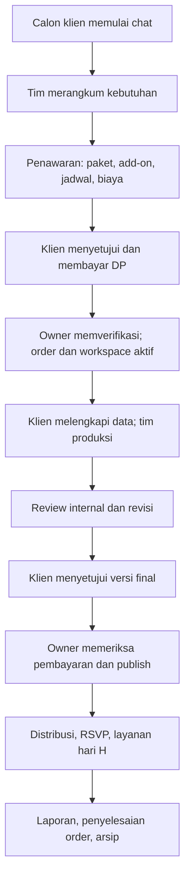

# Occasio — Productized Wedding Service

Versi: baseline bisnis 1.0 · 8 September 2026

Dokumen ini merevisi `business-model-ocassio.md` yang diberikan pemilik. Ejaan merek diseragamkan menjadi **Occasio**, mengikuti aplikasi dan judul dokumen asal. Nama merek tetap perlu dikonfirmasi sebelum publikasi.

Status: **baseline G0 disetujui pemilik pada 8 September 2026** untuk menjadi acuan development. Persetujuan ini bukan pernyataan bahwa fitur telah tersedia dan tidak mengizinkan deployment atau pembelian layanan. Harga adalah baseline internal yang akan divalidasi melalui pencatatan biaya dan pilot sebelum menjadi harga jual final. Roadmap pelaksanaannya ada di [roadmap-production.md](roadmap-production.md).

## 1. Model bisnis dan hasil yang dijual

Occasio menjual **layanan wedding digital per acara dengan paket, hasil kerja, batas layanan, dan proses pengerjaan yang terukur**. Dashboard adalah alat klien dan tim untuk menyelesaikan pesanan tersebut. Bisnis awalnya bukan langganan SaaS mandiri untuk vendor lain; white-label atau SaaS vendor menjadi kemungkinan pengembangan setelah layanan utama terbukti.

Hasil yang diterima klien:

- Undangan sesuai template dan data pasangan, melalui pemeriksaan tim serta persetujuan klien.
- Workspace untuk mengisi data, mengelola tamu, berkomunikasi, dan melihat progres.
- Link undangan personal, RSVP, dan laporan sesuai paket.
- Untuk pesanan yang mencakup layanan venue: perangkat, petugas, dan dukungan dengan jadwal serta cakupan tertulis.

Janji nilai: proses pemesanan dan produksi yang jelas, desain konsisten, pengelolaan tamu yang rapi, serta bantuan sesuai paket. Klaim seperti paling murah, viral, margin sangat tinggi, dan lebih murah daripada cetak tidak digunakan tanpa bukti.

## 2. Target dan batas layanan

| Segmen | Kebutuhan | Penawaran yang sesuai |
| --- | --- | --- |
| Pasangan dengan kebutuhan sederhana | Cepat memahami proses, undangan inti, biaya pasti | Basic |
| Pasangan yang mengelola tamu lebih intensif | QR, laporan, koordinasi melalui workspace | Premium |
| Pasangan dengan kebutuhan venue | Pendampingan penerimaan tamu dan visual yang lebih personal | Signature, setelah kapasitas operasional diverifikasi |

Ukuran acara saja tidak menentukan paket. Jumlah pintu masuk, durasi layanan, waktu kedatangan puncak, kondisi internet, dan kebutuhan petugas ikut menentukan kebutuhan venue.

Bukan cakupan otomatis: wedding organizer menyeluruh, fotografer profesional, cetak foto, penyedia layar/proyektor, dekorasi venue lengkap, atau pengiriman WhatsApp otomatis. Semua layanan tambahan harus tertulis dalam penawaran.

## 3. Nama paket dan satu acuan produk

Nama publik mengikuti keputusan percakapan: **Basic / Premium / Signature**. Silver / Gold / Platinum di dokumen asal diperlakukan sebagai nama lama, bukan tiga paket tambahan.

| Nama lama | Nama publik | Arah layanan |
| --- | --- | --- |
| Silver | Basic | Undangan digital inti |
| Gold | Premium | Pengelolaan tamu dan QR |
| Platinum | Signature | Pendampingan dan layanan venue terukur |

ID teknis lama tidak perlu langsung diganti hanya demi nama. Saat development, katalog, invoice, order, dan pembatasan fitur harus memakai satu definisi paket berversi. Pesanan menyimpan salinan harga, cakupan, dan batas paket pada saat disepakati; perubahan harga baru tidak mengubah order lama.

## 4. Baseline paket untuk development

Angka di tabel berikut menjadi **baseline internal development**. Harga berasal dari tampilan aplikasi sebelumnya, bukan riset harga pasar, sehingga belum boleh diperlakukan sebagai daftar harga jual final sebelum validasi biaya dan pilot. Kuota dan cakupan dipakai untuk membangun pembatasan fitur versi pertama.

| Cakupan | Basic | Premium | Signature |
| --- | --- | --- | --- |
| Harga acuan pembahasan | Rp799.000 | Rp1.490.000 | Rp2.990.000; perlu hitung ulang jika termasuk venue |
| Workspace dan chat dengan tim | Ya | Ya | Ya, prioritas pada jam layanan |
| Template | Koleksi Basic yang sudah diuji | Koleksi Basic + Premium yang sudah diuji | Koleksi Premium + penyesuaian visual terbatas |
| Data acara, maps, countdown, galeri, RSVP, ucapan | Ya | Ya | Ya |
| Informasi rekening hadiah | Opsional | Opsional | Opsional |
| Impor tamu dan link personal | Ya | Ya | Ya |
| Distribusi WhatsApp awal | Dibuka dan dikirim manual oleh pengguna | Sama | Sama |
| QR dan layar check-in | Tidak termasuk | Termasuk fitur; perangkat/petugas klien | Termasuk fitur dan rencana pendampingan venue |
| Layanan perangkat/petugas Occasio | Tidak termasuk | Add-on tertulis | Usulan 1 tablet + 1 petugas, maksimal 4 jam pada hari H |
| Rekaman undangan maksimum | 150 | 500 | 1.000 |
| Galeri undangan | 10 foto | 30 foto | 50 foto |
| Revisi yang dikerjakan tim | 2 putaran | 3 putaran | 5 putaran |
| Masa akses publik sejak publish pertama | 3 bulan | 6 bulan | 12 bulan |
| Live gallery / photo booth / slideshow | Tidak termasuk | Add-on setelah lolos uji | Add-on setelah lolos uji; tidak otomatis termasuk |

Premium fokus pada fitur digital, sehingga biaya kru dan perjalanan tidak tersembunyi dalam paket murah. Signature direncanakan membawa layanan venue yang dibatasi, tetapi **belum tersedia untuk dijual** sampai biaya, wilayah, kru, perangkat, dan simulasi venue disahkan.

Tidak menggunakan istilah unlimited untuk tamu, revisi, media, atau desain. Tambahan kapasitas diberi harga dan batas baru yang disetujui sebelum dikerjakan.

### Definisi kuota dan waktu

- Satu rekaman undangan = satu penerima/keluarga dengan satu token undangan. Bukan satu orang hadir. Jumlah pax dicatat terpisah dan tidak boleh disamakan dengan jumlah undangan.
- Satu putaran revisi = satu daftar perubahan terkumpul yang dikerjakan tim. Perbaikan kesalahan tim tidak mengurangi kuota klien. Perubahan konsep atau struktur di luar scope menjadi add-on.
- Klien boleh mengedit draft dalam field yang disediakan. Edit mandiri tidak otomatis mengurangi kuota revisi tim. Konten yang diajukan kembali tetap melalui pemeriksaan dan antrean kerja.
- Batas foto di atas berlaku untuk galeri undangan; foto profil/cover dan kuota penyimpanan total per event perlu dicatat terpisah pada spesifikasi media. Live gallery punya kuota sendiri dan tidak berarti penyimpanan tanpa batas.
- Masa aktif dimulai pada publish pertama, bukan reset tiap revisi. Sistem memeriksa bahwa tanggal acara tercakup; kebutuhan akses lebih lama dimasukkan ke penawaran sebelum pembayaran.
- Usulan workspace persiapan berlaku sampai 90 hari sebelum publish, dengan perpanjangan tertulis bila perlu. Penundaan acara ditangani lewat perubahan order, bukan menghapus tanggal kedaluwarsa diam-diam.
- Usulan dukungan: Senin–Sabtu, 09.00–17.00 WIB, respons awal maksimal satu hari kerja. Respons awal bukan janji masalah selesai. Dukungan hari H hanya sesuai jadwal yang dipesan.

### Scope venue yang harus ada di penawaran

Kota/radius layanan, satu atau beberapa venue, tanggal dan jam, waktu setup, jam operasional, jumlah petugas/perangkat, biaya transportasi/parkir/lembur, sumber listrik, internet dan cadangan, kontak PIC, prosedur alat rusak, serta skenario antrean harus jelas. Usulan Signature 1 perangkat/1 petugas/4 jam belum boleh dijual sebelum D02 disahkan dan simulasi venue lolos.

Jika harga Signature tidak menutup biaya dan kontribusi yang ditargetkan, sesuaikan harga atau scope; jangan menjanjikan venue lebih dulu lalu menanggung kekurangannya.

## 5. Add-on dan katalog desain

Add-on yang masuk akal: tambahan kuota undangan, perpanjangan, domain khusus, putaran revisi, percepatan pengerjaan saat kapasitas tersedia, tambahan perangkat/petugas/jam, QR card cetak, dan penyesuaian visual.

Live gallery, photo booth, serta slideshow dibuka bertahap setelah perangkat dan alur unggah diuji. Live gallery adalah layanan penerbitan foto; penyediaan fotografer bukan otomatis termasuk. Photo booth digital tidak otomatis mencakup kamera profesional atau printer.

Penyesuaian Signature menggunakan satu template dan pilihan visual yang dibatasi. Desain dari nol adalah proyek tambahan dengan brief, harga, dan jadwal terpisah. Hindari janji “100% sesuai semua keinginan”.

Nama template harus berbeda dari nama klien. Sheila & Yoga adalah contoh event. Buat satu katalog resmi; koleksi marketing dan template yang benar-benar dapat dirender saat ini masih perlu direkonsiliasi. Konsep yang belum tersedia diberi status internal, bukan tombol beli aktif.

Usulan nama konsep generik: Cinema Story dan Playlist Romance untuk inspirasi film/musik, tanpa mengesankan hubungan resmi dengan merek layanan lain. Dark/light mode hanya dijanjikan pada template yang telah diuji. Musik diputar setelah interaksi pengguna; autoplay bersuara dapat dibatasi browser. [Panduan autoplay MDN](https://developer.mozilla.org/en-US/docs/Web/Media/Guides/Autoplay)

## 6. Perjalanan pelanggan dan SOP



1. **Konsultasi:** chat menjadi kanal utama. Calon klien tidak harus memiliki event atau akun berbayar untuk menghubungi tim. Tim mengumpulkan tanggal, lokasi, jumlah undangan/pax, kebutuhan perangkat, template, paket, dan budget lewat percakapan. WhatsApp dapat menjadi kanal alternatif; bukan otomatis integrasi chat dua arah.
2. **Penawaran:** cantumkan scope, total harga, biaya tambahan, waktu pengerjaan sejak materi lengkap, tanggal target publish, syarat pembayaran, dan masa berlaku penawaran. Usulan masa berlaku: tujuh hari kalender.
3. **Pembayaran:** usulan DP 50%, pelunasan sebelum publish. Transfer manual diverifikasi owner; unggahan bukti saja tidak mengubah status menjadi lunas. Ketentuan pembatalan, pengembalian dana, dan perubahan jadwal harus disepakati sebelum order diterima.
4. **Onboarding:** buat order setelah DP terverifikasi. Undang klien untuk menetapkan password sendiri; jangan mengirim password tetap melalui WhatsApp. Percakapan dan brief calon klien ditautkan ke order yang sama.
5. **Produksi:** target pengerjaan baru dimulai setelah data wajib lengkap dan slot tim disepakati. Task mencantumkan penanggung jawab dan deadline; keterlambatan materi dicatat serta diinformasikan.
6. **Review:** owner memeriksa kualitas, klien menyetujui isi versi tertentu. Permintaan perubahan menyertakan catatan, bukan hanya status. Riwayat perubahan dapat ditelusuri.
7. **Publish:** hanya owner berwenang. Periksa persetujuan versi final, pembayaran, data wajib, fitur paket, dan tanggal akses. Mengedit setelah publish menghasilkan draft baru; versi lama tetap tampil sampai versi baru disetujui.
8. **Hari H:** hanya layanan yang tercantum di order yang dijalankan. Tetapkan PIC klien, petugas check-in, perangkat dan cadangan. Gangguan internet memiliki prosedur pencatatan manual dan rekonsiliasi.
9. **Penutupan:** kirim laporan sesuai paket, rekonsiliasi biaya tambahan, tutup order, dan minta izin penggunaan testimoni/portofolio. Selesai acara tidak berarti langsung menghapus undangan.

### Status yang tidak boleh dicampur

| Objek | Contoh status | Makna |
| --- | --- | --- |
| Lead | Baru → diskusi → penawaran → menang/kalah | Perjalanan calon klien |
| Pembayaran | Belum bayar → DP terverifikasi → lunas / pengembalian | Status uang, bukan status konten |
| Order | Onboarding → produksi → review → siap rilis → layanan berjalan → selesai / batal | Pekerjaan tim |
| Versi konten | Draft → review tim → revisi → persetujuan klien → disetujui | Berlaku untuk versi tertentu |
| Publikasi | Belum publish → published → ditarik / expired | Akses tamu ke versi yang disetujui |

Order selesai dapat tetap memiliki undangan published sampai masa aktif habis. Arsip pekerjaan tidak sama dengan akses publik selamanya.

## 7. Pembagian peran dan permukaan aplikasi

| Pengguna | Pekerjaan dan akses |
| --- | --- |
| Calon klien | Lihat paket/template, mulai chat privat, menerima penawaran |
| Owner | Lead, penawaran, pembayaran, alokasi tim, review, publish, laporan |
| Tim produksi | Event yang ditugaskan, konten, media, task; tanpa kewenangan pembayaran otomatis |
| Klien | Order miliknya, chat, draft, tamu, persetujuan, invoice dan laporan miliknya |
| Petugas venue | Check-in event yang ditugaskan pada masa tugas; tidak melihat keuangan |
| Pengunggah foto | Unggah dan kelola media event yang ditugaskan bila add-on aktif |
| Tamu | Undangan dan RSVP miliknya; tidak memperoleh seluruh daftar tamu |

Lokal: website publik `localhost:4174`, management `localhost:3001` langsung login, undangan `/wedding/[slug]`. Port ini alamat development, bukan tiga bisnis terpisah.

Usulan susunan online kelak: website penjualan pada domain utama, management pada `app.<domain>` langsung login, dan undangan pada `/wedding/[slug]` di domain utama. Subdomain per pasangan menjadi opsi lanjutan. Nama domain, penyedia hosting, dan susunan final belum ditetapkan atau dibeli.

## 8. Pendapatan dan biaya yang realistis

Pendapatan utama berasal dari paket per event, add-on, serta perpanjangan. Pendapatan white-label tidak dimasukkan ke target awal.

Biaya langsung per event harus menghitung waktu produksi dan komunikasi, revisi, pemrosesan media, pemakaian penyimpanan/transfer, biaya transaksi, petugas, transportasi, perangkat, cetak, vendor tambahan, dan cadangan pengerjaan ulang. Waktu owner tetap punya biaya meski belum dibayar sebagai gaji.

Biaya tetap mencakup infrastruktur, domain, software, pemasaran, administrasi, serta biaya tim yang memang tetap. Hindari menghitung biaya yang sama dua kali. Investasi tablet dihitung sebagai pengeluaran awal dan dialokasikan per pemakaian dalam perhitungan biaya layanan.

```text
Kontribusi per event = harga bersih setelah diskon - biaya langsung event
Margin kontribusi = kontribusi / harga bersih
Hasil operasional periode = total kontribusi - biaya tetap periode
Kebutuhan event impas = biaya tetap / rata-rata kontribusi per event
```

Contoh aritmetika untuk menguji harga, bukan proyeksi pasar atau jaminan hasil:

| Paket | Harga contoh | Biaya langsung asumsi | Kontribusi | Margin kontribusi |
| --- | ---: | ---: | ---: | ---: |
| Basic | Rp799.000 | Rp350.000 | Rp449.000 | 56,2% |
| Premium | Rp1.490.000 | Rp650.000 | Rp840.000 | 56,4% |
| Signature | Rp2.990.000 | Rp1.900.000 | Rp1.090.000 | 36,5% |

Dengan komposisi contoh 6 Basic + 3 Premium + 1 Signature, omzet adalah Rp12.254.000, biaya langsung Rp5.950.000, dan kontribusi Rp6.304.000. Jika biaya tetap Rp2.000.000, sisa sebelum pajak dan penyesuaian lain adalah Rp4.304.000. Tidak disebut laba bersih. Dengan komposisi yang sama, kontribusi rata-rata Rp630.400 dan kebutuhan impas sekitar empat event per bulan, sepanjang kapasitas serta biaya asumsi tersebut benar.

DP membantu arus kas untuk pesanan; bukan berarti seluruh DP adalah keuntungan yang boleh dihabiskan. Harga final ditetapkan setelah mencatat jam kerja dan biaya dari simulasi/pilot. Harga penyedia hosting dan kuota layanan cloud diverifikasi saat memilih infrastruktur; dokumen ini tidak mengasumsikan free tier selalu mencukupi.

## 9. Retensi dan layanan setelah acara

Baseline development: setelah akses publik kedaluwarsa, workspace menyediakan ekspor read-only selama 30 hari. Sebelum retensi berakhir, kirim pemberitahuan dan sediakan perpanjangan atau ekspor. Jadwal penghapusan media, data tamu, cadangan, serta penyimpanan catatan transaksi ditetapkan terpisah dalam kebijakan final sebelum pilot berbayar.

Foto, chat, daftar tamu, dan rekening memiliki akses sesuai tujuan. Materi klien tidak otomatis menjadi portofolio. Kebijakan pembatalan, retensi, dan penggunaan materi perlu selesai sebelum menerima order berbayar.

## 10. Urutan penawaran yang disarankan

1. Bangun alur lengkap Basic dengan data persisten, chat, order, pembayaran manual, persetujuan, dan publish.
2. Tambahkan Premium setelah QR/check-in lolos pengujian beberapa perangkat.
3. Aktifkan Signature setelah simulasi venue, biaya, staf, dan fasilitas disahkan. Jangan tampilkan paket ini sebagai siap dipesan lebih awal.
4. Live gallery, photo booth, slideshow, otomasi pesan, dan white-label mengikuti bukti kebutuhan serta kapasitas; bukan syarat untuk menuntaskan undangan inti.

Jika pemilik memilih meluncurkan ketiga paket sekaligus, seluruh syarat paket dan simulasi venue harus selesai sebelum peluncuran. Tidak ada kewajiban deploy pada akhir suatu minggu tertentu.

## 11. Ukuran keberhasilan

Pantau lead masuk dan sumbernya, waktu respons, konversi penawaran ke DP, jam kerja per order, kelengkapan materi, waktu produksi, jumlah revisi, publish tepat waktu, kontribusi per paket, keterlambatan pelunasan, serta insiden hari H. Target angka ditetapkan setelah ada baseline; contoh target 10–50 event/bulan dari dokumen awal belum menjadi komitmen.

Kapasitas penjualan mengikuti jumlah jam produksi yang tersedia dan slot kru/perangkat pada tanggal yang sama. Batasi penerimaan order bila kapasitas tidak mencukupi.

## 12. Keputusan pemilik sebelum implementation

| ID | Keputusan | Rekomendasi awal | Status |
| --- | --- | --- | --- |
| D01 | Nama merek dan paket | Occasio; Basic / Premium / Signature | Disahkan sebagai baseline G0 |
| D02 | Scope venue | Premium digital; Signature 1 tablet + 1 petugas/4 jam, wilayah tertentu | Signature/venue ditunda dan tidak dijual; detail disahkan sebelum pengembangan paket tersebut |
| D03 | Harga dan kontribusi minimum | Basic Rp799.000; Premium Rp1.490.000; Signature Rp2.990.000 | Disahkan sebagai baseline internal; harga jual final menunggu validasi biaya/pilot |
| D04 | Kuota, revisi, waktu kerja | Gunakan tabel bagian 4 dan definisinya | Disahkan sebagai baseline development |
| D05 | Pembayaran, pembatalan, perubahan jadwal | DP 50%, lunas sebelum publish; aturan pengecualian tertulis | Alur pembayaran disahkan; kebijakan refund/pembatalan wajib selesai sebelum pilot berbayar |
| D06 | Retensi, ekspor, izin materi | Akses sesuai masa paket; ekspor read-only 30 hari setelah expired | Disahkan sebagai baseline development; jadwal hapus final sebelum pilot berbayar |
| D07 | Kanal konsultasi dan penanggung jawab | Chat privat calon klien dan klien; WA opsional | Disahkan sebagai baseline G0 |
| D08 | Cakupan rilis pertama | Basic lebih dulu, Premium lalu Signature setelah gerbang kualitas masing-masing | Disahkan sebagai baseline G0 |
| D09 | Infrastruktur dan online | Putuskan setelah uji; deployment manual dengan persetujuan pemilik | Auto-deploy tidak diizinkan |

**Keputusan G0:** lulus untuk memulai audit dan development Basic. Premium belum masuk rilis pertama. Signature dan seluruh layanan venue tetap terkunci sampai keputusan operasional tambahannya disahkan. Item kebijakan yang masih terbuka tidak boleh disamarkan sebagai fitur atau layanan siap jual.

## 13. Koreksi utama terhadap dokumen asal

- SaaS utama diubah menjadi layanan per event; SaaS vendor menjadi kemungkinan masa depan.
- Paket dan ejaan merek diseragamkan; harga, fasilitas, dan batas yang bertentangan diberi status keputusan.
- Klaim unlimited, zero marginal cost, pure profit, dan balik modal dari satu order dihapus.
- Dashboard tersedia untuk semua klien; fitur layanan membedakan paket.
- Persetujuan klien, pembayaran terverifikasi, versi konten, dan masa aktif dimasukkan ke SOP.
- Bulk share tidak berarti pengiriman otomatis atau bukti pesan terkirim.
- On-site, fotografer, perangkat slideshow, dan desain khusus dipisahkan scope-nya.
- Portofolio, kapasitas tim, retensi data, serta tahapan aktivasi paket dijadikan bagian operasional.
